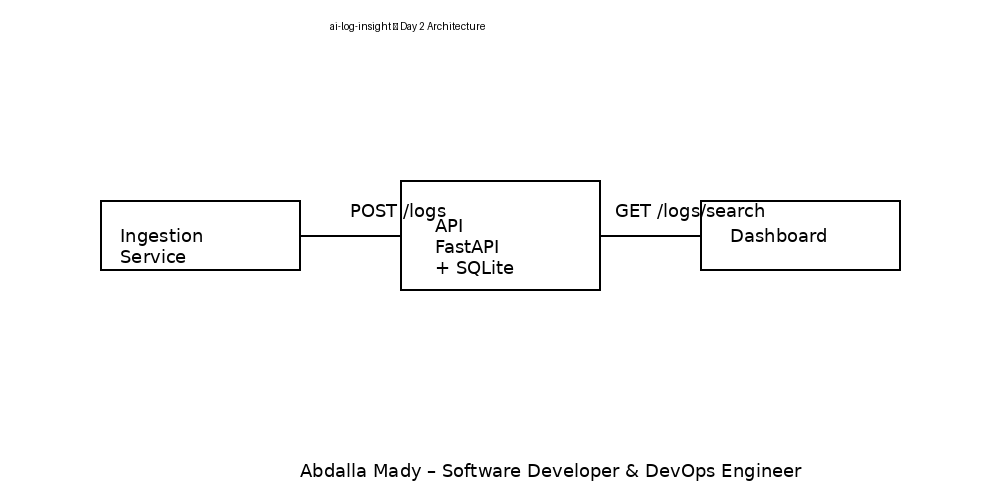

 # ai-log-insight

AI-powered log analysis playground built step by step with a DevOps and software engineering mindset.

The goal of this project is to ingest application logs, store them in a structured way, and progressively evolve toward AI-assisted log analysis and incident investigation.

This repository is developed incrementally (Day 1, Day 2, …), with each step adding real functionality and architectural improvements.

---

## Day 2 – Log Persistence & Basic Search

Day 2 focuses on moving from a stateless setup to **real log persistence** and **basic querying capabilities**.

At this stage, logs are no longer just printed to stdout:  
they are stored in a database and can be retrieved through an API.

This is a key step before introducing semantic search and AI-based analysis.

---

## Architecture – Day 2



### Components

- **Ingestion Service**
  - Python-based service
  - Sends structured JSON logs to the backend API
  - Simulates logs coming from multiple application services

- **API Service**
  - Built with FastAPI
  - Responsibilities:
    - Persist logs into a SQLite database
    - Expose search endpoints to retrieve logs
  - Uses a Docker volume to persist data across restarts

- **Dashboard**
  - Minimal static UI served via Nginx
  - Calls the backend search API
  - Displays logs retrieved from the database

---

## What Changed from Day 1

Compared to Day 1:

- Logs are now **persisted** instead of printed only
- Introduced a real database (SQLite)
- Added a search endpoint to retrieve logs
- Dashboard now reads data from the backend API
- Docker Compose includes a persistent volume for data storage

---

## API Endpoints (Day 2)

### Health Check


GET /health


Returns API status and version.

---

### Log Ingestion


POST /logs


Example payload:

```json
{
  "timestamp": "2026-01-28T10:15:00Z",
  "level": "ERROR",
  "service": "payment",
  "message": "Timeout from payment gateway"
}


The log is stored in the SQLite database.

Log Search
GET /logs/search


Optional query parameters:

level (INFO, WARN, ERROR)

service (e.g. payment, order)

Examples:

/logs/search?level=ERROR
/logs/search?service=order
/logs/search?level=ERROR&service=payment

Tech Stack (Day 2)

Python 3.11

FastAPI + Uvicorn

SQLite (persistent storage)

Requests (ingestion service)

Nginx (static dashboard)

Docker

Docker Compose

Repository Structure
ai-log-insight/
│
├── api/
│   ├── app.py
│   ├── requirements.txt
│   └── Dockerfile
│
├── ingestion-service/
│   ├── main.py
│   ├── requirements.txt
│   └── Dockerfile
│
├── dashboard/
│   ├── index.html
│   └── Dockerfile
│
├── docker-compose.yml
├── ai-log-insight-day2-diagram.png
└── README.md

How to Run

Make sure Docker and Docker Compose are installed.

docker-compose up --build

Access the services

API health:

http://localhost:8000/health


Dashboard:

http://localhost:8080


From the dashboard, you can load logs retrieved from the SQLite database via the backend API.

Data Persistence

Logs are stored in a SQLite database located inside a Docker volume:

Volume name: db-data

Data survives container restarts

This keeps the setup simple while still being realistic and production-inspired.

Current Limitations (Day 2)

No full-text or semantic search

No AI or embeddings

Minimal dashboard

No authentication or rate limiting

These limitations are intentional and will be addressed incrementally.

Next Steps

Planned roadmap:

Day 3

Vector embeddings (FAISS)

Semantic log search

Day 4

Natural language queries (RAG)

Incident and root-cause insights

Day 5+

Advanced dashboard

Security and observability improvements

Author

Abdalla Mady
Software Developer & DevOps Engineer